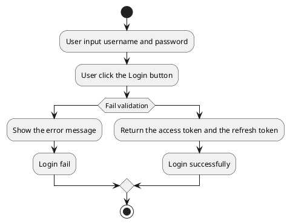
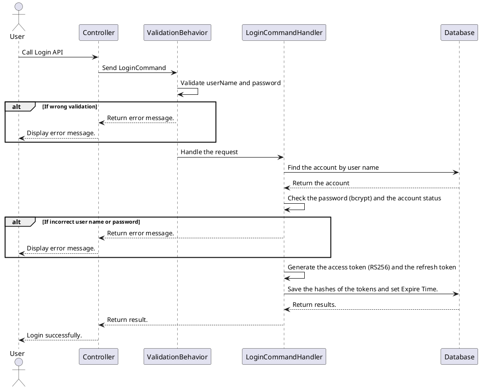

[TOC]

---
## Overview

Signs a user in with a user name and a password.

On success the API returns an access token and a refresh token:

- The access token is a JWT signed with RS256 and valid for 24 hours.
- The refresh token is a random value valid for 7 days.
- The database keeps only hashes of both tokens and the time the refresh token expires; the tokens themselves are never stored.

Clients call the API gateway (`http://localhost:8088` in development), which sends `/api/auth/*` to the identity service. Every response, success or error, has the same four fields: `result`, `isSuccess`, `statusCode`, `message`.

## API Specification

| API        | URL             |
| ---------- | --------------- |
| POST       | /api/auth/login |
| Permission | N/A             |

## Request sample
```json
{
    "userName": "userName",
    "password": "password"
}
```

| Field    | Description                         | Data Type | Examples   |
| -------- | ----------------------------------- | --------- | ---------- |
| userName | The user name account need to login | string    | `userName` |
| password | The password of user name account   | string    | `password` |

## Response sample

```json
{
  "result": {
    "accessToken": "eyJhbGciOiJSUzI1NiIsInR5cCI6IkpXVCJ9...",
    "refreshToken": "Qm9vc3RlZFJhbmRvbVZhbHVl..."
  },
  "isSuccess": true,
  "statusCode": 200,
  "message": "Sign in successfully"
}
```

## Validation 

<table>
    <th>Status code</th>
    <th>Description</th>
    <th>Examples</th>
    <tbody>
        <tr>
            <td>400</td>
            <td>The user name is missing (also when the request body is empty)</td>
<td>

```json
{
  "result": null,
  "isSuccess": false,
  "statusCode": 400,
  "message": "userName is missing."
}
```
</td>
        </tr>
        <tr>
            <td>400</td>
            <td>The password is missing</td>
<td>

```json
{
  "result": null,
  "isSuccess": false,
  "statusCode": 400,
  "message": "password is missing."
}
```
</td>
        </tr>
        <tr>
            <td>400</td>
            <td>The incorrect user name or password (the same answer for an unknown user name or an account that cannot sign in)</td>
<td>

```json
{
  "result": null,
  "isSuccess": false,
  "statusCode": 400,
  "message": "Incorrect username or password. Try again."
}
```
</td>
        </tr>
        <tr>
            <td>400</td>
            <td>The request body is not valid JSON</td>
<td>

```json
{
  "result": null,
  "isSuccess": false,
  "statusCode": 400,
  "message": "The request body is not valid."
}
```
</td>
        </tr>
        <tr>
            <td>500</td>
            <td>An unexpected error (the details are only written to the log)</td>
<td>

```json
{
  "result": null,
  "isSuccess": false,
  "statusCode": 500,
  "message": "An unexpected error occurred. Please try again later."
}
```
</td>
        </tr>
    </tbody>
</table>

## Activity Diagram



## Sequence Diagram


