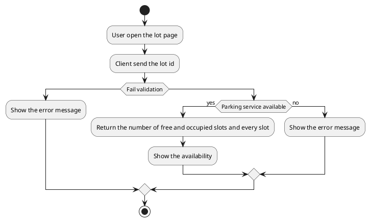
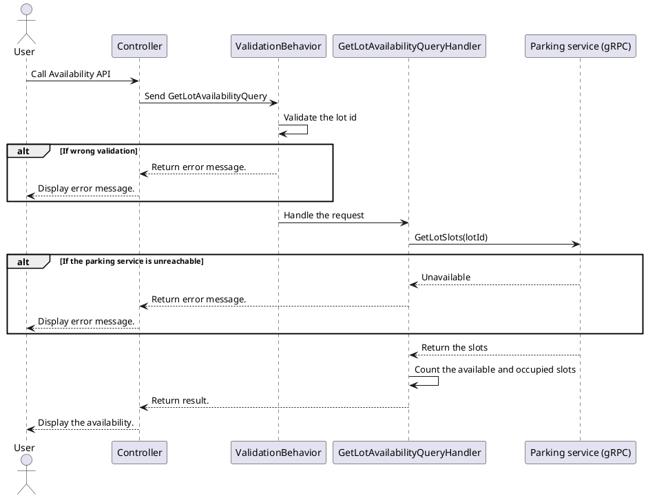

[TOC]

---
## Overview

Returns how many slots of a parking lot are free and how many are occupied, and the status of every slot. The booking service asks the parking service over gRPC (`GetLotSlots`), which keeps the latest status reported by the cameras.

The API is public: guests can browse lots without signing in. Clients call the API gateway (`http://localhost:8088` in development). Every response, success or error, has the same four fields: `result`, `isSuccess`, `statusCode`, `message`.

## API Specification

| API        | URL                                       |
| ---------- | ----------------------------------------- |
| GET        | /api/booking/lots/{lotId}/availability    |
| Permission | N/A                                       |

## Request sample

The request has no body. The lot is given in the URL:

```
GET /api/booking/lots/00000000-0000-0000-0000-000000000001/availability
```

| Field | Description                | Data Type | Examples                               |
| ----- | -------------------------- | --------- | -------------------------------------- |
| lotId | The lot to look at (in URL) | guid      | `00000000-0000-0000-0000-000000000001` |

## Response sample

```json
{
  "result": {
    "lotId": "00000000-0000-0000-0000-000000000001",
    "total": 2,
    "available": 1,
    "occupied": 1,
    "slots": [
      { "code": "A-01", "status": "Available", "updatedAt": "2026-09-29T13:20:10+00:00" },
      { "code": "A-02", "status": "Occupied", "updatedAt": "2026-09-29T13:20:14+00:00" }
    ]
  },
  "isSuccess": true,
  "statusCode": 200,
  "message": "Lot availability retrieved successfully."
}
```

| Field     | Description                                             | Data Type | Examples      |
| --------- | ------------------------------------------------------- | --------- | ------------- |
| total     | Number of slots the parking service knows for the lot   | number    | `2`           |
| available | Slots whose status is `Available`                       | number    | `1`           |
| occupied  | Slots whose status is `Occupied`                        | number    | `1`           |
| slots     | Every known slot, ordered by code                       | array     | see the sample |

A lot without any known slot returns `total`, `available` and `occupied` equal to 0 and an empty `slots` array.

## Validation 

<table>
    <th>Status code</th>
    <th>Description</th>
    <th>Examples</th>
    <tbody>
        <tr>
            <td>400</td>
            <td>The lot id is missing (the empty GUID 00000000-0000-0000-0000-000000000000)</td>
<td>

```json
{
  "result": null,
  "isSuccess": false,
  "statusCode": 400,
  "message": "lotId is missing."
}
```
</td>
        </tr>
        <tr>
            <td>404</td>
            <td>The lot id in the URL is not a GUID, so no route matches</td>
<td>

```json
{
  "result": null,
  "isSuccess": false,
  "statusCode": 404,
  "message": "The requested resource was not found."
}
```
</td>
        </tr>
        <tr>
            <td>503</td>
            <td>The parking service cannot be reached</td>
<td>

```json
{
  "result": null,
  "isSuccess": false,
  "statusCode": 503,
  "message": "The parking service is not available. Try again later."
}
```
</td>
        </tr>
        <tr>
            <td>500</td>
            <td>An unexpected error (the details are only written to the log)</td>
<td>

```json
{
  "result": null,
  "isSuccess": false,
  "statusCode": 500,
  "message": "An unexpected error occurred. Please try again later."
}
```
</td>
        </tr>
    </tbody>
</table>

## Activity Diagram



## Sequence Diagram


