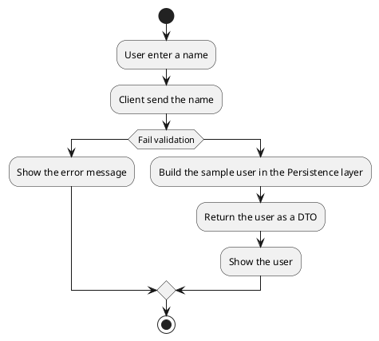
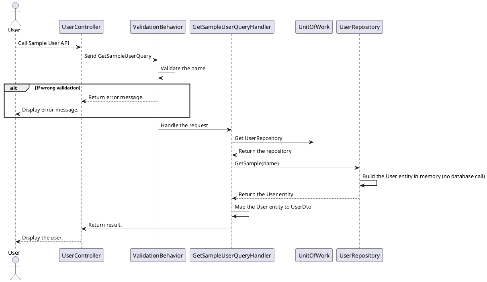

[TOC]

---
## Overview

Returns a sample user under the name given in the query string. The request goes through every layer of the identity service: the controller, the MediatR query and its validator, the handler, the unit of work and the user repository. The repository builds the user in memory and does not read the database, so the same name always gives the same answer.

The identity service does not ask for a token on this API, so it can be called directly on the service (`http://localhost:5000` when the service runs from the IDE). Through the API gateway (`http://localhost:8088` in development) every `/api/identity/...` URL needs a signed-in user. Every response, success or error, has the same four fields: `result`, `isSuccess`, `statusCode`, `message`.

## API Specification

| API        | URL                        |
| ---------- | -------------------------- |
| GET        | /api/identity/users/sample |
| Permission | N/A                        |

## Request sample

The request has no body. The name is given in the query string:

```
GET /api/identity/users/sample?name=Loc
```

| Field | Description                                  | Data Type | Examples |
| ----- | -------------------------------------------- | --------- | -------- |
| name  | The name the sample user gets (query string) | string    | `Loc`    |

## Response sample

```json
{
  "result": {
    "id": "11111111-1111-1111-1111-111111111111",
    "name": "Loc",
    "email": "sample.user@example.com",
    "phoneNumber": "0900000000"
  },
  "isSuccess": true,
  "statusCode": 200,
  "message": "Sample user retrieved successfully."
}
```

| Field       | Description                              | Data Type | Examples                               |
| ----------- | ---------------------------------------- | --------- | -------------------------------------- |
| id          | The fixed id of the sample user          | guid      | `11111111-1111-1111-1111-111111111111` |
| name        | The name sent in the request             | string    | `Loc`                                  |
| email       | The fixed email of the sample user       | string    | `sample.user@example.com`              |
| phoneNumber | The fixed phone number of the sample user | string    | `0900000000`                           |

## Validation 

<table>
    <th>Status code</th>
    <th>Description</th>
    <th>Examples</th>
    <tbody>
        <tr>
            <td>400</td>
            <td>The name is missing, empty or only spaces</td>
<td>

```json
{
  "result": null,
  "isSuccess": false,
  "statusCode": 400,
  "message": "name is missing."
}
```
</td>
        </tr>
        <tr>
            <td>500</td>
            <td>An unexpected error (the details are only written to the log)</td>
<td>

```json
{
  "result": null,
  "isSuccess": false,
  "statusCode": 500,
  "message": "An unexpected error occurred. Please try again later."
}
```
</td>
        </tr>
    </tbody>
</table>

## Activity Diagram



## Sequence Diagram


